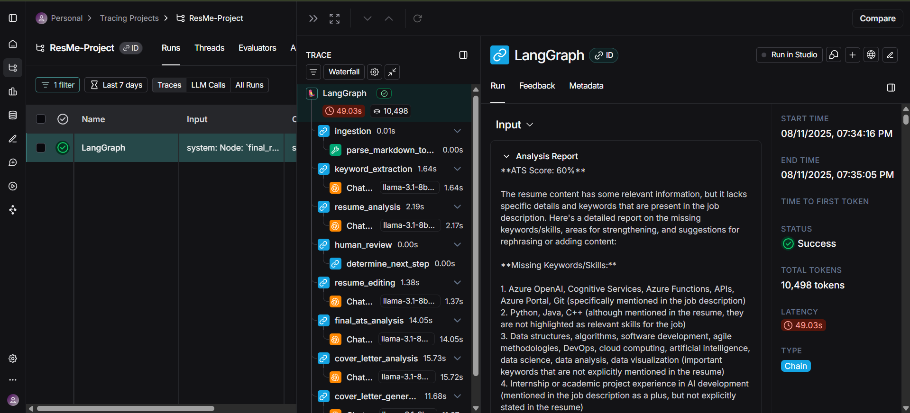

# ResMe

ResMe is an advanced resume optimization tool that leverages cutting-edge Large Language Models (LLMs) and multi-agent AI architectures to help users create highly effective resumes and cover letters — now enhanced with **LangSmith integration** for real-time debugging and monitoring.

---

## 🚀 Key Technologies
- **LangGraph** – Orchestrates dynamic, agentic workflows across multiple AI agents for robust, context-aware optimization.
- **Multi-AI Agent System** – Specialized agents for keyword extraction, resume analysis, editing, ATS scoring, and cover letter generation.
- **Groq & Tavily APIs** – Power high-speed, high-quality LLM text generation and enrichment.
- **LangSmith** – Provides detailed tracing, debugging, and monitoring of the entire optimization pipeline.

---

## 🔍 How It Works
1. **User Input**
   - Provide your resume (Markdown or LaTeX) and a job description (URL or text).
   - Supply your API keys via `.env`.

2. **Agentic Processing**
   - LangGraph coordinates multiple specialized agents:
     - **Keyword Extractor** – Pulls critical skills from the job description.
     - **Resume Analyst** – Scores and analyzes the resume against the JD.
     - **Resume Editor** – Enhances language and ATS alignment.
     - **Cover Letter Generator** – Creates tailored, professional letters.
   - Each step is **fully traceable in LangSmith** for transparency and debugging.

3. **Output**
   - Optimized resumes and cover letters are saved to the `outputs/` folder.
   - LangSmith dashboard shows:
     - All prompts and LLM responses
     - Tool usage
     - State transitions between agents

---

## ✨ Features
- ✅ Resume optimization with Groq-powered LLMs  
- ✅ ATS scoring before and after optimization  
- ✅ Tailored cover letter generation  
- ✅ Multi-agent workflow for better specialization  
- ✅ **LangSmith-powered debugging & monitoring**  

---

## 🖼️ LangSmith Dashboard Example

Below is a screenshot of the LangSmith dashboard showing a trace of the multi-agent workflow:



---

## 🛠️ Prerequisites
- Python 3.10+
- [uv](https://github.com/astral-sh/uv) for dependency management (recommended)
- API keys:
  - [Groq](https://console.groq.com/keys)
  - [Tavily](https://app.tavily.com/keys)
  - [LangSmith](https://smith.langchain.com/)

---

## ⚙️ Setup Instructions

### 1️⃣ Clone the Repository
```powershell
pip install uv
git clone https://github.com/Urvish0/ResMe.git
cd ResMe
```

### 2️⃣ Create a Virtual Environment
```powershell
uv init 
uv venv or uv venv {your_env_name}
.\.venv\Scripts\Activate.ps1
```
### 3️⃣ Install Dependencies (using uv)
```powershell
uv add -r requirements.txt
```

### 🔑 Configuration

Create a `.env` file in the project root with:

```env
GROQ_API_KEY=your_groq_key_here
TAVILY_API_KEY=your_tavily_key_here

# LangSmith for debugging & monitoring
LANGSMITH_API_KEY=your_langsmith_key_here
LANGCHAIN_TRACING_V2=true
LANGCHAIN_PROJECT=ATS-Resume-Optimizer
```

> ⚠️ **Never commit `.env` files containing sensitive API keys.**

---

## ▶️ Usage

### 1. Prepare Your Resume

- Use **Markdown** or **LaTeX** format.
- Example template provided in `resume.md`.

### 2. Run the Optimizer

```powershell
uv run .\version0.py
```

- Follow the prompts to provide your job description and resume.

### 3. View Results

- Check the `outputs/` folder for:
  - `optimized_resume_*.md`
  - `cover_letter_*.md`
- View full execution trace in **LangSmith Dashboard**:
  - Prompts, responses, and tool calls
  - Agent-to-agent transitions
  - Execution times

---

## 📊 LangSmith Integration

ResMe uses **LangSmith** for:

- **Prompt & Response Tracking** – See every LLM prompt and generated text.
- **Workflow Debugging** – Trace exactly which agent handled each step.
- **Performance Monitoring** – Identify slow or error-prone nodes.
- **Experimentation** – Compare prompt variations and outputs in a unified interface.

---


---

## 📄 License

This project is licensed under the MIT License - see the [LICENSE](LICENSE) file for details.

---


